# Planificación, ejecución y documentación de pruebas

Resultados de las 9 pruebas del plan (PRU-01 a PRU-09), ejecutadas el
**03/10/2026** contra el stack local completo (`./up.sh`): frontend React,
backend Go, Postgres, Supabase Auth (GoTrue), Mailpit, MinIO y el
microservicio de IA con Spleeter. No se usaron mocks: cada prueba crea sus
propios usuarios, proyectos y audios `.wav`, y recorre la aplicación real.

| ID | HU | Tipo | Objetivo | Estado |
|---|---|---|---|---|
| [PRU-01](#pru-01) | HU-VER-B01 | Funcional | Obtener versiones y detalle de una canción | ✅ Aprobada |
| [PRU-02](#pru-02) | HU-COM-B01 | Funcional | Obtener comentarios de una versión, ordenados por fecha | ✅ Aprobada |
| [PRU-03](#pru-03) | HU-COM-B02 | Funcional | Agregar comentario a una versión con timestamp de audio | ✅ Aprobada |
| [PRU-04](#pru-04) | HU-IA-B01 | Funcional | Separar el audio de una versión en pistas con IA | ✅ Aprobada |
| [PRU-05](#pru-05) | HU-NOT-F02 | Integración | Invitación y aceptación de un proyecto | ✅ Aprobada |
| [PRU-06](#pru-06) | HU-IA-B01, HU-BUQ-B03 | Integración | Stems separados disponibles en el listado/filtrado de la versión | ✅ Aprobada |
| [PRU-07](#pru-07) | HU-SEG-B01 | Seguridad | Rechazo de request sin token a endpoint protegido | ✅ Aprobada |
| [PRU-08](#pru-08) | HU-SEG-B01 | Seguridad | Un Músico no puede crear una versión | ✅ Aprobada (tras corrección) |
| [PRU-09](#pru-09) | HU-COM-B04 | Seguridad | Un Músico no puede eliminar un comentario ajeno | ✅ Aprobada (tras corrección) |

**Resultado global: 9 aprobadas.** Las pruebas encontraron 2 defectos que
se corrigieron (ver [Defectos encontrados](#defectos-encontrados)).

## Cómo están implementadas

| Nivel | Dónde | Qué cubre |
|---|---|---|
| End-to-end (Playwright) | `stemhub-system/tests/e2e/specs/pru-0X-*.spec.ts` | Las 9 pruebas, sobre la UI y la API reales; generan la evidencia de este documento |
| Unitarias backend (Go) | `Stem-Hub-BackEnd/internal/service/cancion_version_permiso_test.go`, `comentario_eliminar_test.go`, `internal/router/router_test.go` | Reglas de PRU-07, PRU-08 y PRU-09 sin base de datos (corren en CI) |
| Unitarias frontend (Vitest) | `stemhub-frontend/src/features/songs/CommentsPanel.test.tsx` | Visibilidad del botón "Eliminar comentario" (PRU-09) |

Correr las pruebas end-to-end (con el stack levantado):

```bash
cd stemhub-system/tests/e2e
npm install
npx playwright test          # las 9; ~1 minuto
npx playwright show-report   # reporte HTML con capturas y trazas
```

Requieren `ffmpeg` (genera los `.wav` de prueba) y Google Chrome. Cada
corrida reemplaza la evidencia en `docs/pruebas/evidencia/PRU-XX/`.

**Correspondencia con la API real.** El plan nombra endpoints genéricos;
en StemHub las rutas están anidadas por proyecto y canción:

| En el plan | En la API |
|---|---|
| `POST /api/versions` | `POST /proyectos/{p}/canciones/{c}/versiones` (multipart, campo `archivo`) |
| `DELETE /api/comments/{id}` | `DELETE /proyectos/{p}/canciones/{c}/versiones/{v}/comentarios/{id}` |
| tabla `versions` | tabla `cancionversion` |
| rol "Musico" | rol de proyecto `Músico (Artista)` (sin permisos de gestión) |

---

<a id="pru-01"></a>
## PRU-01

| Campo | Detalle |
|---|---|
| **ID de prueba** | PRU-01 |
| **Nombre** | Obtener versiones y detalle de una canción |
| **HU referenciada** | HU-VER-B01 |
| **Pantalla** | VER-ALL-DETAIL-02 (Detalle de Canción) |
| **Datos de entrada** | Proyecto con una canción con 2 versiones: v1.0.0 (`.wav` de 60 s, sin notas) y v1.1.0 (`.wav` de 45 s, notas "Mezcla nueva: bajo más presente y voz al frente.") |
| **Pasos** | 1. El usuario se autentica. 2. Ingresa al proyecto. 3. Ingresa a la canción con dos versiones y navega entre ellas. |
| **Resultado esperado** | El sidebar de versiones muestra las dos versiones; al navegar entre ellas se actualizan la pista de audio y las notas de versión. |
| **Resultado obtenido** | El sidebar "VERSIONES" lista exactamente 2 versiones (v1.1.0 y v1.0.0). Al elegir v1.0.0 el front pide el audio de esa versión (`GET .../versiones/{v1}/audio`, 200), el reproductor pasa a `0:00 / 1:00` y las notas a "Esta versión no tiene notas cargadas.". Al volver a v1.1.0 pide su audio, el reproductor muestra `0:00 / 0:45` y aparecen sus notas. |
| **Estado** | ✅ Aprobada |
| **Automatización** | `tests/e2e/specs/pru-01-versiones-detalle.spec.ts` |

**Evidencia**

| Detalle con v1.0.0 seleccionada | Detalle con v1.1.0 seleccionada |
|---|---|
| 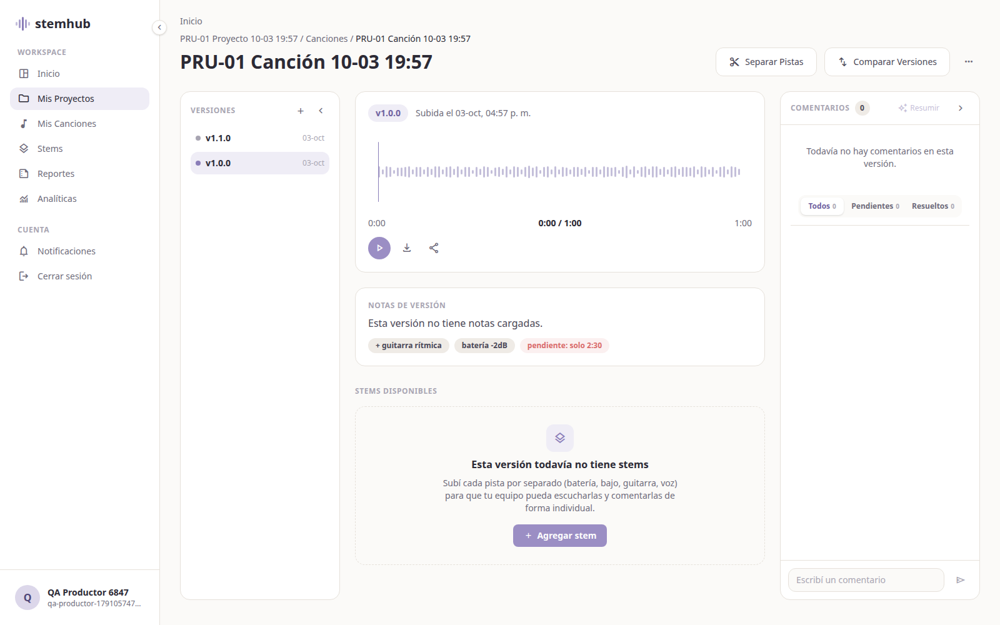 | 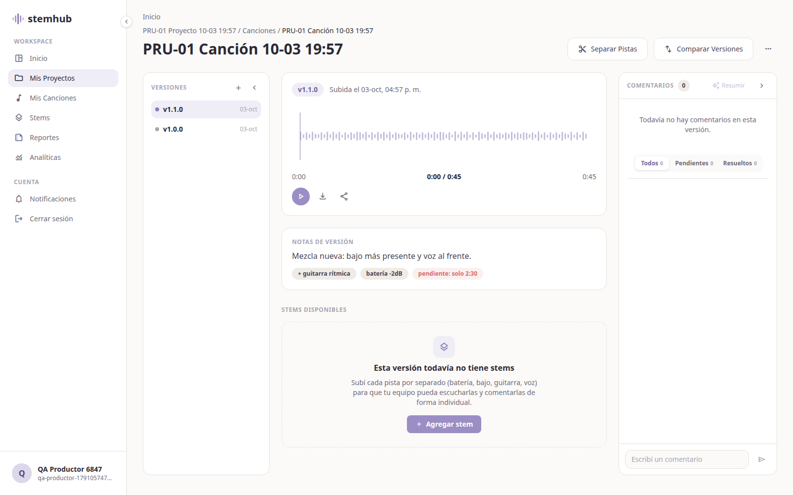 |

Más: [proyecto con la canción](evidencia/PRU-01/03-proyecto-con-cancion.png) ·
[respuesta de `GET .../versiones`](evidencia/PRU-01/02-api-listado-versiones.png)

---

<a id="pru-02"></a>
## PRU-02

| Campo | Detalle |
|---|---|
| **ID de prueba** | PRU-02 |
| **HU referenciada** | HU-COM-B01 — Obtener comentarios de una versión |
| **Pantalla** | VER-ALL-DETAIL-02 (Detalle de Canción – Sidebar de Comentarios) |
| **Datos de entrada** | Una versión con 5 comentarios de dos autores (Productor y Músico), con timestamps 0:05, 0:18, 0:42, 1:01 y 1:35, dados de alta hace 5, 4, 3, 2 y 1 días |
| **Pasos** | 1. Autenticarse. 2. Abrir la versión con comentarios. 3. Consultar el endpoint que lista los comentarios de esa versión. |
| **Resultado esperado** | Se devuelven los 5 comentarios ordenados por fecha de creación, con autor, timestamp de audio y texto. |
| **Resultado obtenido** | `GET .../versiones/{v}/comentarios` responde 200 con los 5 comentarios, ordenados por fecha de creación **del más reciente al más antiguo**. Cada uno trae `autor.nombre`, `tiempoInicioSegundos` y `texto`, y coinciden con lo cargado y con la tabla `comentario`. El panel de la pantalla muestra los 5 en el mismo orden, con autor, fecha relativa ("ayer", "hace 2 días"…) y marca de tiempo. |
| **Estado** | ✅ Aprobada |
| **Automatización** | `tests/e2e/specs/pru-02-listar-comentarios.spec.ts` |

**Evidencia**

| Panel de comentarios | Respuesta del endpoint y datos en la BD |
|---|---|
| 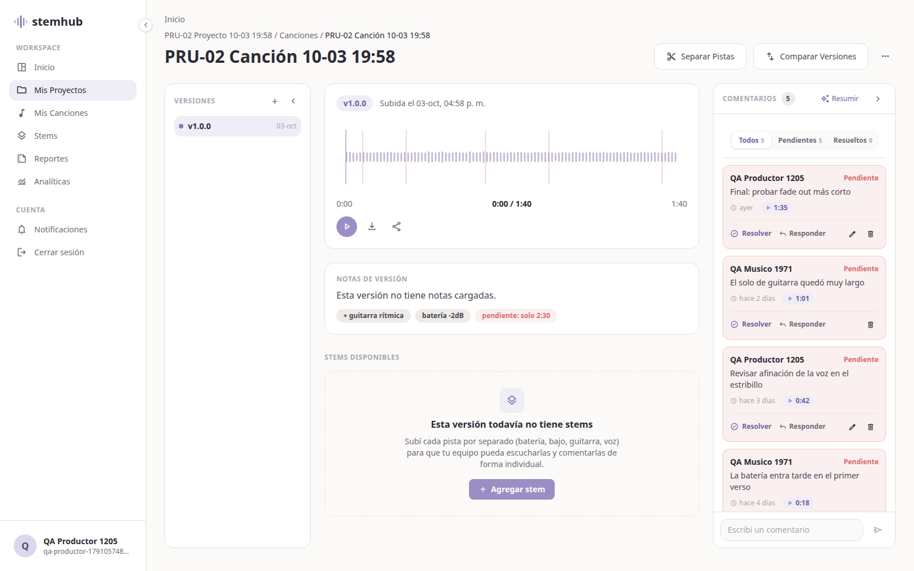 | 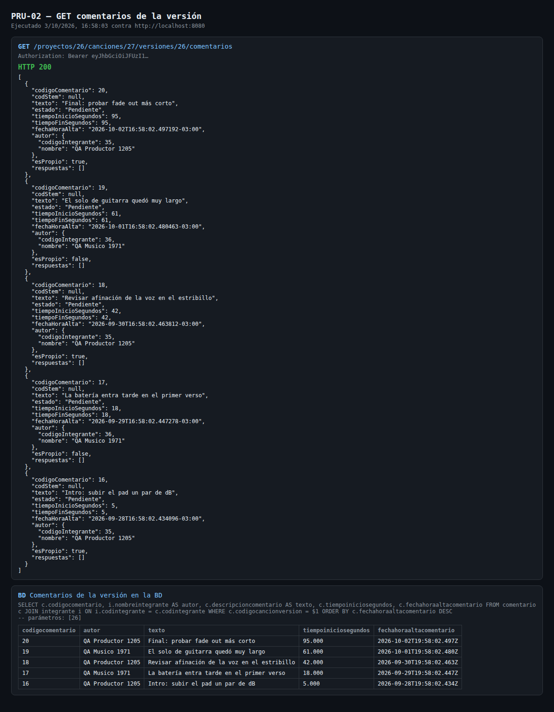 |

> Las fechas de alta se fijaron con un `UPDATE` en la BD porque la API
> siempre registra la fecha actual.

---

<a id="pru-03"></a>
## PRU-03

| Campo | Detalle |
|---|---|
| **ID de prueba** | PRU-03 |
| **HU referenciada** | HU-COM-B02 — Agregar comentario a una versión |
| **Pantalla** | VER-ALL-DETAIL-02 (Sidebar de Comentarios) |
| **Datos de entrada** | Versión existente (`.wav` de 100 s); texto "El bajo no se escucha en este fragmento"; timestamp 00:01:23 |
| **Pasos** | 1. Autenticarse. 2. Abrir la versión y posicionar el reproductor en el segundo 83 (click en la forma de onda). 3. Escribir el comentario y confirmar el envío. |
| **Resultado esperado** | El comentario se persiste asociado a la versión y al timestamp, aparece de inmediato en el listado y su marcador queda en el segundo 83 de la forma de onda. |
| **Resultado obtenido** | El click deja el reproductor en `1:23 / 1:40` y el panel muestra el rango pendiente "1:23". Al enviar, `POST .../comentarios` responde 201 y el comentario aparece al instante con la marca `1:23`. En la forma de onda se dibuja el marcador del comentario al 83 % del ancho (segundo 83). En la BD queda en la versión correcta con `tiempoiniciosegundos = tiempofinsegundos = 83.333`. |
| **Estado** | ✅ Aprobada |
| **Automatización** | `tests/e2e/specs/pru-03-agregar-comentario.spec.ts` |

**Evidencia**

| Antes de enviar (rango 1:23) | Publicado, con marcador en 1:23 |
|---|---|
| 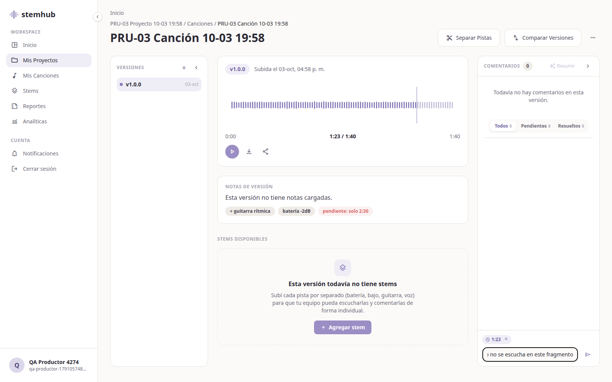 | 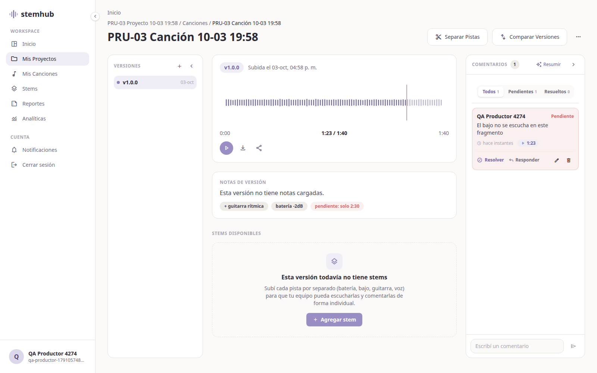 |

Más: [persistencia en la API y en la BD](evidencia/PRU-03/04-persistencia.png)

> El timestamp se guarda con decimales (83,333 s): marcar la forma de onda
> con el mouse no cae justo en un segundo entero. Se muestra como 1:23.

---

<a id="pru-04"></a>
## PRU-04

| Campo | Detalle |
|---|---|
| **ID de prueba** | PRU-04 |
| **HU referenciada** | HU-IA-B01 — Procesamiento de separación de pistas |
| **Pantalla** | IA-PRD-DETAIL-01 (Separar Instrumentos) |
| **Datos de entrada** | Versión con archivo de audio válido (`.wav` de 60 s, 44,1 kHz estéreo) |
| **Pasos** | 1. Autenticarse. 2. Ingresar a la versión y seleccionar "Separar Pistas" → "4 stems". 3. Esperar el procesamiento (microservicio Python / Spleeter). |
| **Resultado esperado** | El sistema genera y muestra 4 stems (batería, bajo, guitarra/otros, voz) asociados a la versión de origen, permitiendo reproducir cada uno individualmente; los stems no deberían poder reproducirse simultáneamente. |
| **Resultado obtenido** | `POST .../stems/separacion` responde 202, la pantalla muestra "Separando las pistas…" y la separación termina en `COMPLETADA` en unos 12 s. Aparecen 4 stems con etiqueta IA: Batería (`drums.wav`), Bajo (`bass.wav`), Voz (`vocals.wav`) y Otros (`other.wav`), asociados a la versión de origen en la BD. Cada stem se reproduce individualmente; al iniciar Batería mientras sonaba Voz, Voz se detiene y queda un solo stem "Reproduciendo". |
| **Estado** | ✅ Aprobada |
| **Automatización** | `tests/e2e/specs/pru-04-separar-pistas.spec.ts` |

**Evidencia**

| Diálogo "Separar pistas" | Procesando |
|---|---|
| 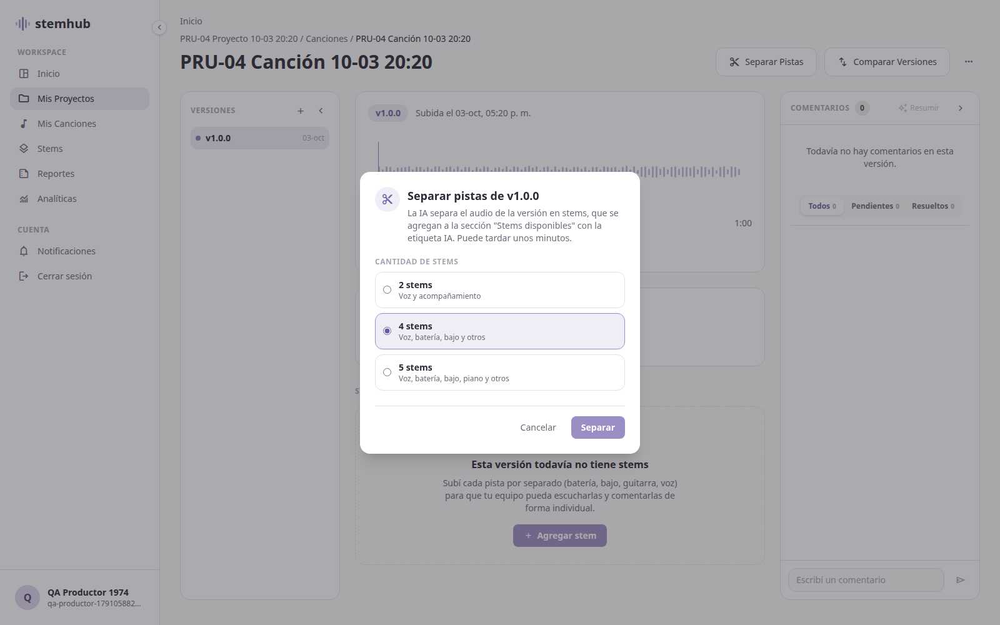 | 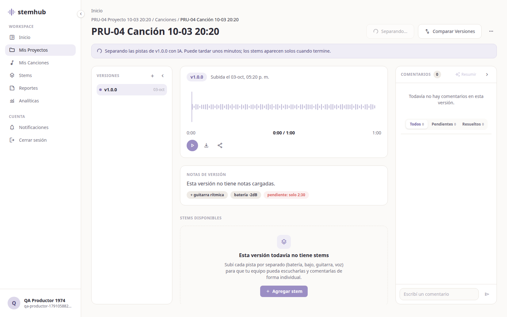 |

| Voz reproduciéndose | Al iniciar Batería, Voz se detiene |
|---|---|
| 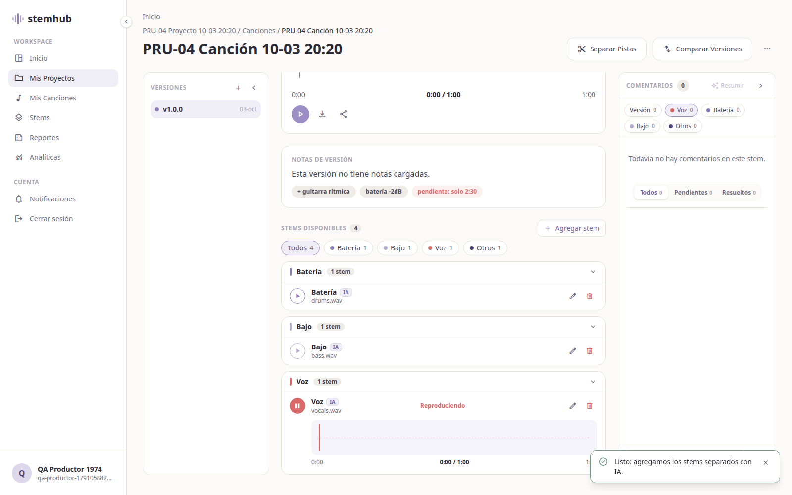 | 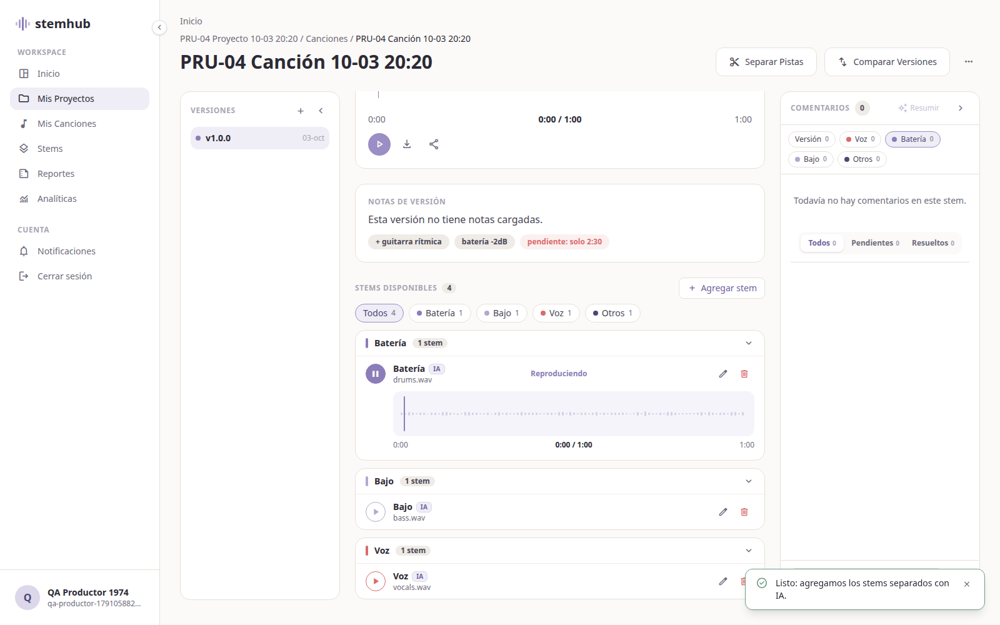 |

Más: [4 stems generados](evidencia/PRU-04/03-stems-generados.png) ·
[estado de la separación, stems y filas en la BD](evidencia/PRU-04/05-api-separacion-y-stems.png)

---

<a id="pru-05"></a>
## PRU-05

| Campo | Detalle |
|---|---|
| **ID de prueba** | PRU-05 |
| **HU referenciada** | HU-NOT-F02 (Invitación a un proyecto) + gestión de colaboradores del módulo de Versionado |
| **Pantalla** | Detalle de Proyecto (VER-ALL-DETAIL-01) |
| **Datos de entrada** | Proyecto existente del Productor; email de un usuario registrado a invitar como Músico |
| **Pasos** | 1. Autenticarse. 2. Ingresar a un proyecto propio. 3. Invitar al usuario con rol Músico ("Compartir"). 4. Verificar que se dispara el email. 5. El invitado acepta. 6. Verificar que queda como colaborador con el rol asignado. |
| **Resultado esperado** | El módulo de notificaciones envía el email y, al aceptar, el módulo de Versionado registra al usuario como Músico del proyecto; ambos quedan consistentes. |
| **Resultado obtenido** | `POST .../invitaciones` responde 201 y la invitación queda "Músico (Artista) · Pendiente". Llega a Mailpit el mail "Te invitaron a colaborar en PRU-05 Proyecto … en StemHub" con el enlace `/invitaciones/{token}`. El invitado, con su sesión, abre el enlace, ve proyecto y rol, acepta, y entra al proyecto. El dueño lo ve en la lista de colaboradores como "Músico (Artista)". En la BD la invitación tiene fecha de aceptación y existe la fila en `integranteproyecto` con ese rol. `GET /proyectos/{p}/integrantes` responde lo mismo. |
| **Estado** | ✅ Aprobada |
| **Automatización** | `tests/e2e/specs/pru-05-invitacion-proyecto.spec.ts` |

**Evidencia**

| Invitación enviada | Mail recibido |
|---|---|
| 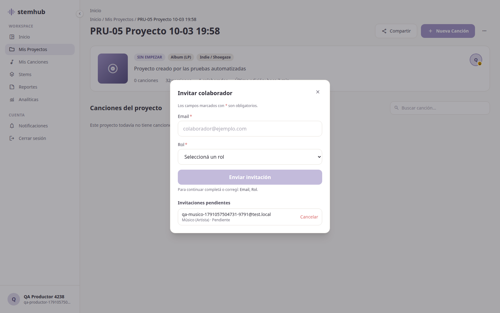 | 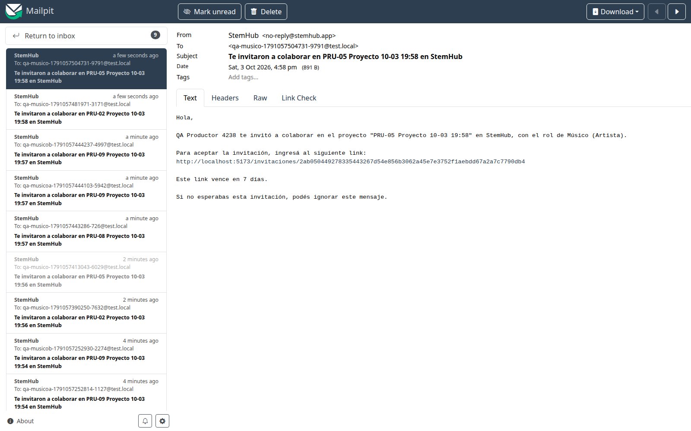 |

| El invitado ve la invitación | Colaboradores del proyecto |
|---|---|
| 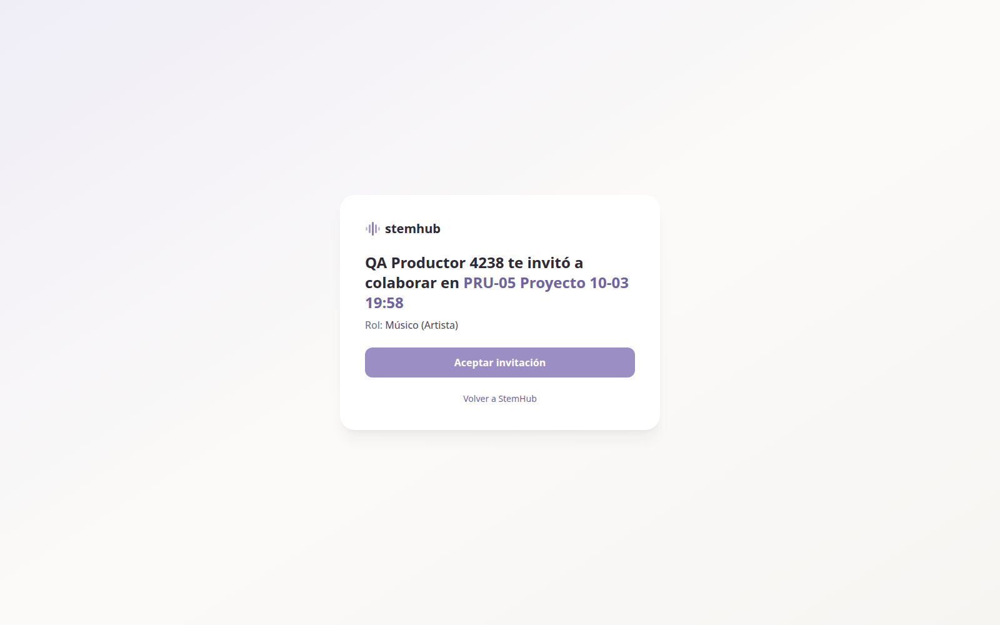 | 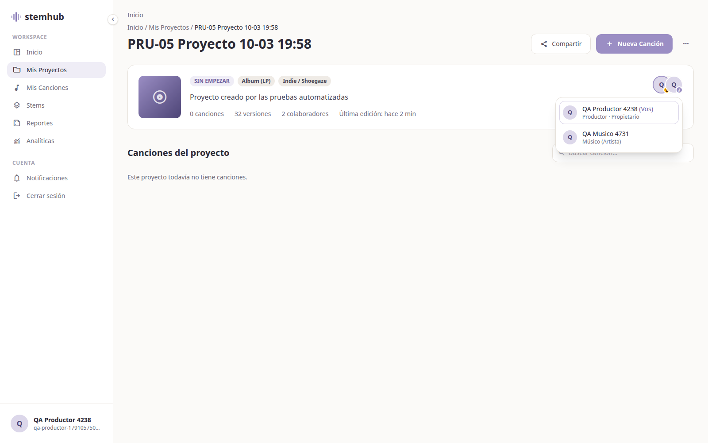 |

Más: [formulario](evidencia/PRU-05/01-formulario-invitacion.png) ·
[invitado dentro del proyecto](evidencia/PRU-05/06-invitado-dentro-del-proyecto.png) ·
[consistencia entre módulos (API y BD)](evidencia/PRU-05/09-consistencia-modulos.png)

---

<a id="pru-06"></a>
## PRU-06

| Campo | Detalle |
|---|---|
| **ID de prueba** | PRU-06 |
| **HU referenciada** | HU-IA-B01, HU-BUQ-B03 |
| **Pantalla** | VER-ALL-DETAIL-02 (Detalle de Canción) |
| **Datos de entrada** | Versión con archivo de audio válido (`.wav` de 3 min) |
| **Pasos** | 1. Autenticarse. 2. Ingresar a la versión y seleccionar "Separar Pistas". 3. Esperar el procesamiento (fuera de la pantalla, para comprobar que no hace falta quedarse). 4. Volver a la versión en el detalle de canción. |
| **Resultado esperado** | El usuario ve el listado de todos los stems separados. |
| **Resultado obtenido** | La separación del audio de 3 minutos termina en `COMPLETADA` en unos 16 s. Al volver al detalle, "STEMS DISPONIBLES" muestra los 4 stems y coinciden uno a uno con `GET .../stems`. El filtro por categoría (HU-BUQ-B03) funciona: "Voz" deja solo el stem de voz y "Todos" vuelve a mostrar los 4. |
| **Estado** | ✅ Aprobada |
| **Automatización** | `tests/e2e/specs/pru-06-stems-en-detalle.spec.ts` |

**Evidencia**

| Listado de stems al volver | Filtrado por categoría "Voz" |
|---|---|
| 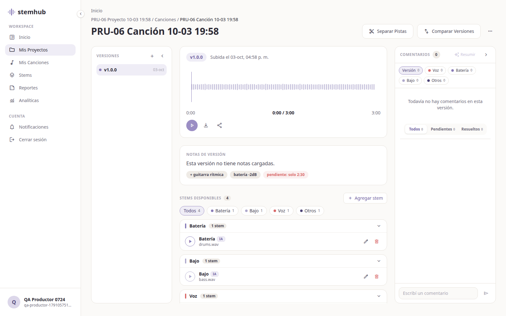 | 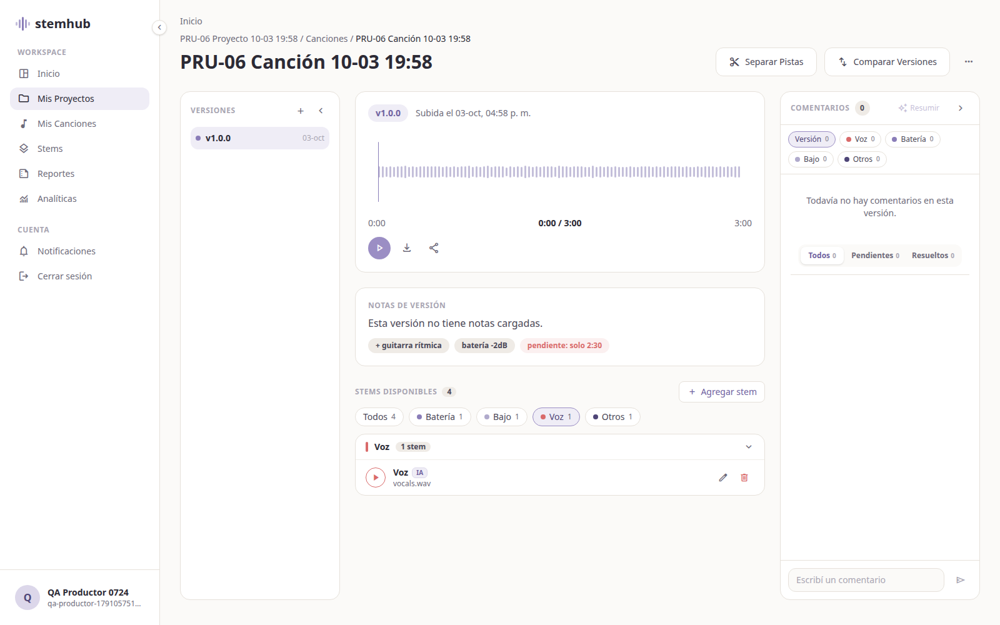 |

Más: [stems de la versión y separación registrada](evidencia/PRU-06/04-api-stems-version.png)

---

<a id="pru-07"></a>
## PRU-07

| Campo | Detalle |
|---|---|
| **ID de prueba** | PRU-07 |
| **HU referenciada** | HU-SEG-B01 |
| **Pantalla** | Backend — `POST /proyectos/{p}/canciones/{c}/versiones` |
| **Datos de entrada** | Request HTTP sin header `Authorization`, con un cuerpo válido (multipart con `.wav`) |
| **Pasos** | 1. Autenticarse. 2. Quitar el token del header. 3. Enviar el POST. 4. Capturar código de respuesta y body. |
| **Resultado esperado** | 401 Unauthorized. El handler no se ejecuta ni modifica la BD. |
| **Resultado obtenido** | Sin header: **401** `{"error":"token de autenticación requerido"}`. Variante con token inválido: **401** `{"error":"token inválido o expirado"}`. La cantidad de versiones de la canción en `cancionversion` es la misma antes y después. El test unitario del router (`TestVersionesYComentarios_RequierenAutenticacion`) confirma que el middleware corta la request antes del handler. |
| **Estado** | ✅ Aprobada |
| **Automatización** | `tests/e2e/specs/pru-07-sin-token.spec.ts`, `Stem-Hub-BackEnd/internal/router/router_test.go` |

**Evidencia**

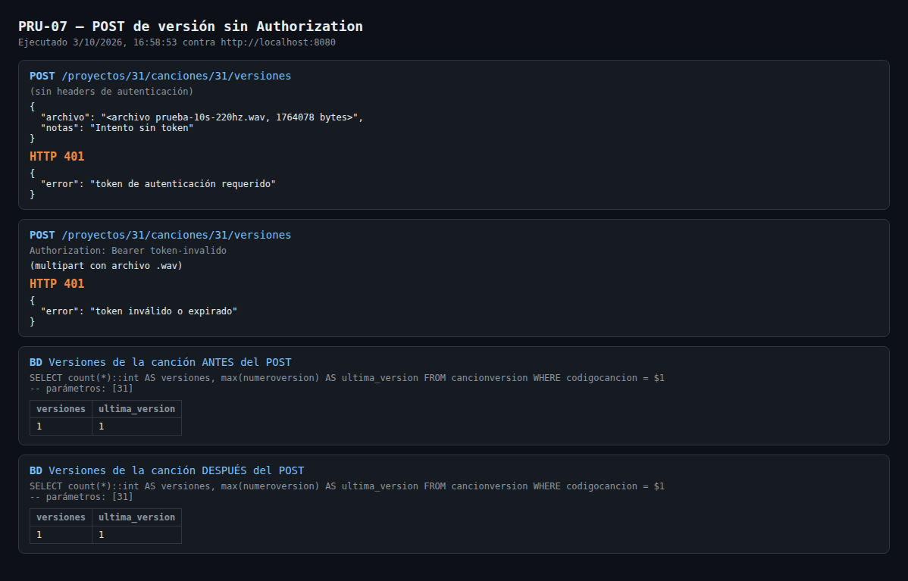

---

<a id="pru-08"></a>
## PRU-08

| Campo | Detalle |
|---|---|
| **ID de prueba** | PRU-08 |
| **HU referenciada** | HU-SEG-B01 |
| **Pantalla** | Backend — `POST /proyectos/{p}/canciones/{c}/versiones` |
| **Datos de entrada** | Token JWT válido de un usuario con rol Músico en el proyecto; body `{"track_id": "abc123", "file_url": "x.wav"}` (y, como control, un multipart válido con `.wav`) |
| **Pasos** | 1. Autenticarse como Músico. 2. Enviar el POST. 3. Recibir la respuesta de operación no válida. 4. Consultar la tabla de versiones. |
| **Resultado esperado** | 403 Forbidden. No se crea ningún registro en la tabla de versiones. |
| **Resultado obtenido** | Con el body del plan: **403** `{"error":"No tenés permiso para crear versiones"}`. Con un `.wav` válido: **403**, mismo mensaje. `cancionversion` tiene la misma cantidad de filas antes y después. **En la primera ejecución el body del plan devolvía 400** "La pista de la nueva versión es obligatoria": el backend validaba el cuerpo antes que el permiso. Se corrigió (ver [D-01](#defectos-encontrados)). |
| **Estado** | ✅ Aprobada (tras corregir D-01) |
| **Automatización** | `tests/e2e/specs/pru-08-musico-sin-permiso.spec.ts`, `Stem-Hub-BackEnd/internal/service/cancion_version_permiso_test.go` |

**Evidencia**

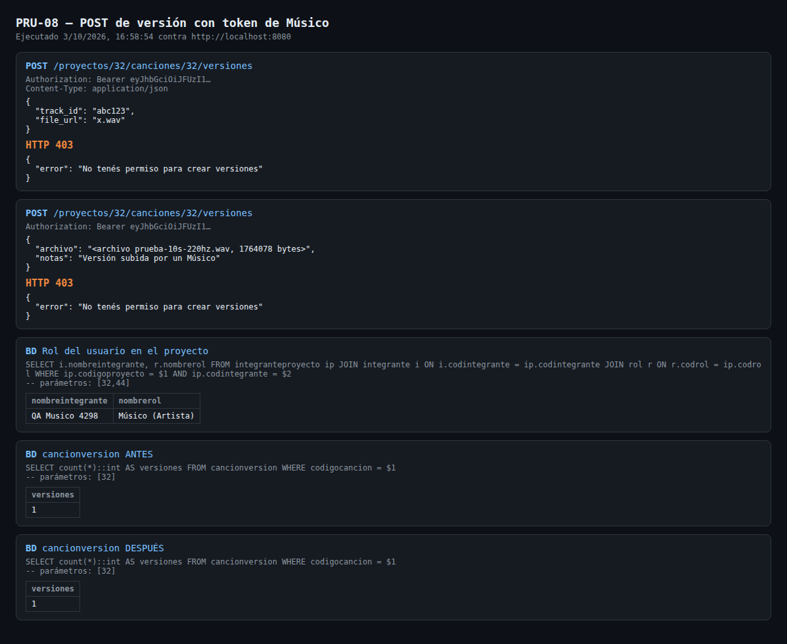

---

<a id="pru-09"></a>
## PRU-09

| Campo | Detalle |
|---|---|
| **ID de prueba** | PRU-09 |
| **HU referenciada** | HU-COM-B04 |
| **Pantalla** | Backend — `DELETE /proyectos/{p}/canciones/{c}/versiones/{v}/comentarios/{id}` |
| **Datos de entrada** | Usuario A (Músico) crea un comentario. Usuario B (Músico), con su propio token, intenta borrarlo. |
| **Pasos** | 1. Crear el comentario con A. 2. Autenticarse como B. 3. Enviar el DELETE con el token de B. 4. Verificar el código. 5. Consultar que el comentario sigue en la BD. |
| **Resultado esperado** | 403 Forbidden. El comentario de A sigue en la BD sin cambios. |
| **Resultado obtenido** | **403** `{"error":"No tenés permisos para eliminar este comentario"}`. La fila del comentario es idéntica antes y después (`fechahorabajacomentario` en NULL). En la pantalla, B ya no ve el botón "Eliminar" en el comentario de A. **En la primera ejecución B sí veía ese botón** (el backend igual rechazaba el borrado). Se corrigió (ver [D-02](#defectos-encontrados)). |
| **Estado** | ✅ Aprobada (tras corregir D-02) |
| **Automatización** | `tests/e2e/specs/pru-09-eliminar-comentario-ajeno.spec.ts`, `Stem-Hub-BackEnd/internal/service/comentario_eliminar_test.go`, `stemhub-frontend/src/features/songs/CommentsPanel.test.tsx` |

**Evidencia**

| DELETE con el token de B y estado en la BD | Vista de B (sin "Eliminar" en el comentario de A) |
|---|---|
| 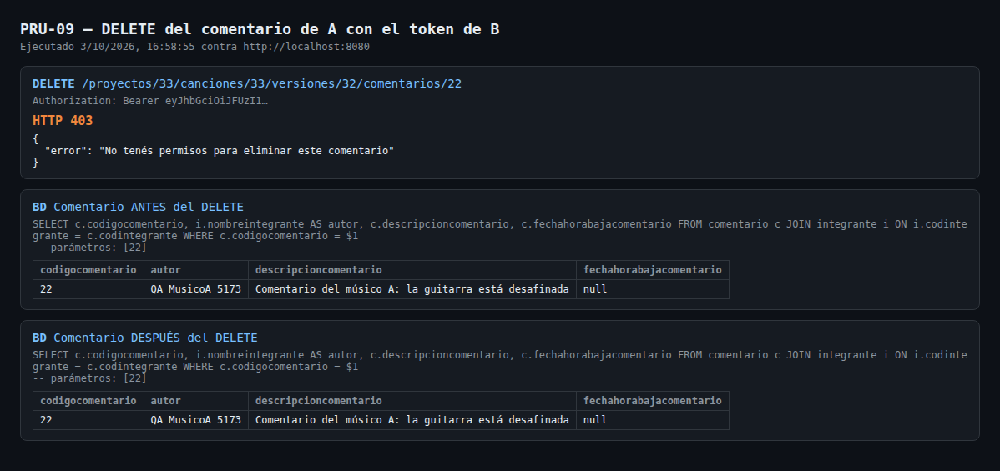 | 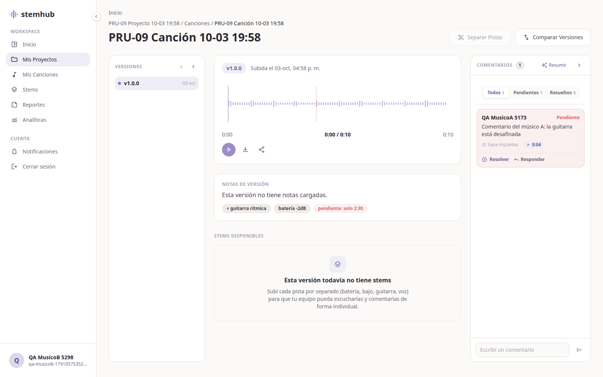 |

---

## Defectos encontrados

| ID | Prueba | Defecto | Corrección | Estado |
|---|---|---|---|---|
| D-01 | PRU-08 | `POST .../versiones` validaba el archivo antes que el permiso: un Músico sin archivo recibía 400 en vez de 403, y el mensaje le revelaba qué espera el endpoint. | `CrearVersion` (`Stem-Hub-BackEnd/internal/service/cancion_service.go`) valida canción, perfil y permiso `GESTIONAR_VERSIONES` antes que el archivo. Test: `TestCrearVersion_SinPermisoYSinArchivoDevuelveSinPermiso`. | Corregido |
| D-02 | PRU-09 | El panel de comentarios mostraba "Eliminar" en todos los comentarios, incluso a quien no puede borrar los ajenos. Al usarlo, el backend respondía 403 y la UI mostraba un error. | `CommentsPanel` muestra "Eliminar" solo en los comentarios propios o si el usuario es Productor (`GESTIONAR_COMENTARIOS`). Test: `CommentsPanel.test.tsx`. | Corregido |

## Observaciones fuera del alcance de las pruebas

- En el detalle de proyecto, "32 versiones" y "Última edición: hace 2 min"
  son valores fijos de maqueta (`MOCK_TOTAL_VERSIONES`,
  `MOCK_ULTIMA_EDICION` en `SongsPage.tsx`), no datos reales. Se ve en la
  captura de PRU-05, en un proyecto sin canciones.
- Un Músico puede marcar como "Resuelto" el comentario de otro integrante:
  el backend no verifica autor ni permiso al cambiar el estado. No lo cubre
  ninguna prueba del plan, pero conviene definir si es lo esperado.
